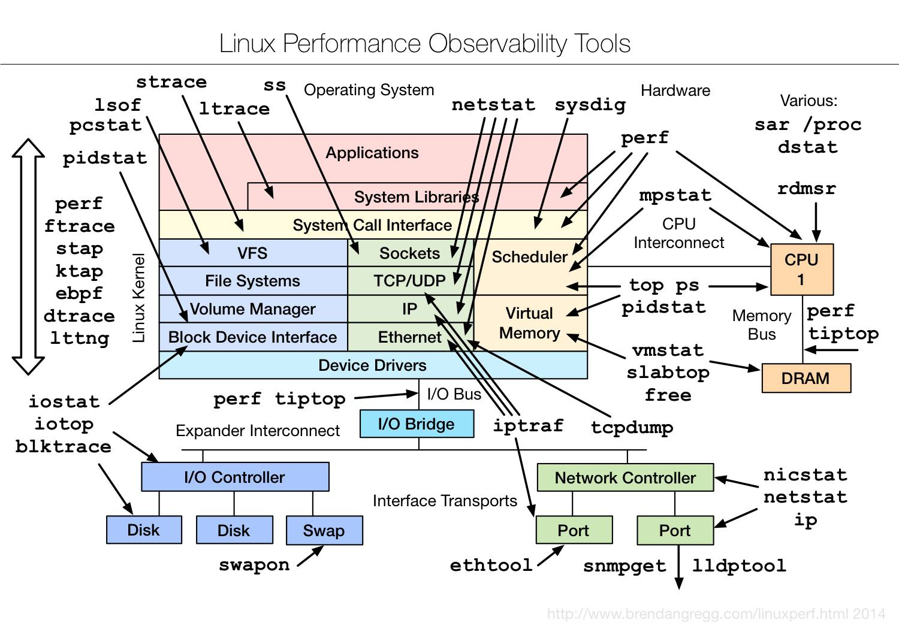

Congratulations!

You hit this page cause you want to be ready for high profile Golang job interview or need to structure your interview questions.  

Golang is a great language for building modern web-applications based on micro-services architecture. Easy to start. Extremely convenient from DevOps perspective.  
https://golang.org/
https://gobyexample.com/

If it's easy to start what makes the difference in development process? 
Deep understanding of Golang infrastructure and its Linux surrounding.

Here's the top 10 reasons why some o
   - Basic networking (protocol headers, web-socket) 
   - Logic and Big O notation
   - Linux unix command
   - Regexp
   - Memory Allocation
   - Bitwise Operators 
   - Luck of algorithmic thinking and experience
   

^\({0,1}((0|\+61)(2|4|3|7|8)){0,1}\){0,1}(\ |-){0,1}[0-9]{2}(\ |-){0,1}[0-9]{2}(\ |-){0,1}[0-9]{1}(\ |-){0,1}[0-9]{3}$

Community 
* Brad Fitzpatrick https://twitter.com/bradfitz
* Dave Cheney https://twitter.com/davecheney
* Russ Cox https://twitter.com/_rsc
* Peter Bourgon https://twitter.com/peterbourgon
* Mitchell Hashimoto https://twitter.com/mitchellh
* Damian Gryski https://twitter.com/dgryski
* Andrew Gerrand https://twitter.com/enneff
* Dmitry Vyukov https://twitter.com/dvyukov
* Brian Ketelsen https://twitter.com/bketelsen
* JBD https://twitter.com/rakyll
* Francesc Campoy https://twitter.com/francesc
* 

